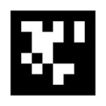

## AprilNav

[](https://www.gnu.org/licenses/old-licenses/lgpl-2.1.en.html)

## Overview

AprilNav is a mobile indoor real-time landmark navigation system. Using printable 2D barcodes, a HD
camera, and a computer, AprilNav is a low cost, scalable, and accurate system for vehicular autonomous
navigation and localization. Matrices (or 2D barcodes) mounted on the ceiling of a room act as a landmark for a camera located anywhere in the same room with up to 5cm of accuracy. AprilNav has sundry of potential applications ranging from robotics education to manufacturing and warehouse vehicles and facilities.

Our team at NASA - MSFC has adapted code (AprilTags) originally created by Edward Olson at University of Michigan and adapted by additional authors at Carnegie Mellon and MIT under the LGPL 2.1 license. AprilTags outputs the location of multiple 2D barcodes located anywhere in 3D space. AprilNav expands upon the AprilTags library estimating the pose of a camera given known coordinates of unique tags. 

AprilNav has been tested and run on MacOS 10.4, Ubuntu 12.04, and Rasbian.

### Prerequisites

Install the following dependencies to run the program (The following was tested on Ubuntu 12.04 and Raspberry Pi running Raspian: 

```
sudo apt-get install subversion cmake libopencv-dev libeigen3-dev libv4l-dev xterm
```

To install on Mac OS using homebrew:
```
sudo port install pkgconfig opencv eigen3
```


### Installing

Once installed, navigate to the AprilNav directory and compile with:

```
make
```

After compiling, run with:

```
./build/bin/AprilNav
```

***Note: Be sure to specify the propper tag size using the -S flag. Display a list of additional customizations using the -h flag

## Authors

* **Tristan Schuler** - *NASA MSFC* 
* **Greta Studier** - *NASA MSFC* 

## Project History

AprilTags was developed by Professor Edwin Olson of the University of
Michigan.  His Java implementation is available on this web site:
  http://april.eecs.umich.edu.

Olson's Java code was ported to C++ and integrated into the Tekkotsu
framework by Jeffrey Boyland and David Touretzky:
  http://wiki.tekkotsu.org/index.php/AprilTags

Michael Kaess (kaess@mit.edu) and Hordur Johannson (hordurj@mit.edu) of MIT
further modified the code and made a standalone library for AprilTags:
  http://people.csail.mit.edu/kaess/apriltags/

----------------------------

todo:
- significant speedup could be achieved by performing image operations
  using OpenCV (Gaussian filter, but also operations in
  TagDetector.cc)
- replacing arctan2 by precomputed lookup table
- converting matrix operations to Eigen (mostly for simplifying code,
  maybe some speedup)
